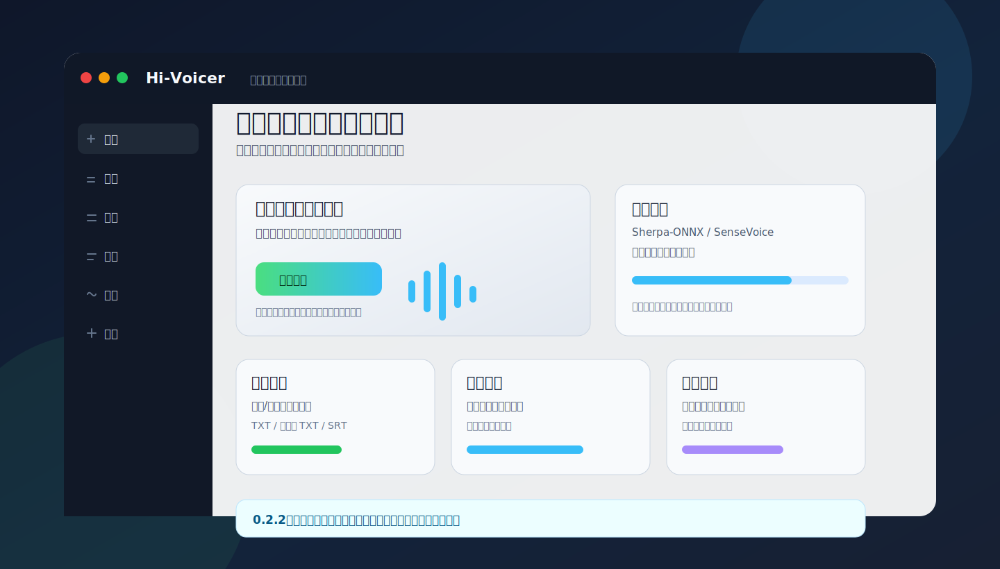

# Hi-Voicer

Hi-Voicer 是一个面向 Windows 的本地离线语音工作台。它把日常语音输入、音频/视频文件转录、字幕校对、术语替换和基础音频处理放在同一个桌面应用里完成；模型、录音、缓存和转录结果默认留在本机，不需要把音频上传到云端服务。



## 适合谁

- 想用快捷键在任意输入框里说话并自动上屏的人。
- 需要把会议、网课、录音、视频整理成文字或字幕的人。
- 希望转录流程尽量离线、本地可控的人。
- 需要批量处理音频、校正字幕片段、维护术语替换表的用户。

## 主要能力

- 语音输入：支持按住说话、连续识别、纯录音三种模式。
- 文件转录：支持音频和常见视频文件，导出纯文本、时间线文本和 SRT 字幕。
- 字幕编辑：校正文案、拆分/合并字幕、播放选中片段、导出选中片段音频，也可以一键导出时间线全部片段。
- 术语库：把常见错词、专有名词和客户名统一替换。
- 音频处理：降噪/增强、格式转换、视频提取音频、波形剪辑、多段选区导出、批量切分和音频合并。
- 批量工作流：音频工具支持单文件、多文件、文件夹导入、拖放、自定义输出目录、处理历史和一键打开输出目录。
- 本机诊断：检查模型、CUDA 回退、麦克风、系统声音和 ffmpeg 状态。

## 1.0.7 更新重点

- 音频页升级为标签式工具区：降噪/增强、格式转换、音频剪辑、音频合并。
- 音频剪辑新增波形预览、播放控制、片段列表和多段选区；按住 `Ctrl` 拖动波形可以直接拉出新选区，按住 `Alt` 滚动鼠标滚轮可以缩放时间线。
- 多段导出支持每段独立文件，也支持按片段顺序合并为单个文件。
- 格式转换支持常见音频格式互转，并可从 MP4、MOV、MKV、WebM 等视频中提取音频。
- 音频合并支持无需重新编码的兼容格式合并，也支持混合格式重新编码合并。
- 字幕页新增“导出全部片段”，可把时间线上的每一句独立导出为音频文件。
- 音频处理结果增加历史保留、清空入口和一键打开输出目录。
- 修复剪辑播放头设置入点时可能回到开头或压缩旧片段的问题。
- 剪辑片段开始/结束支持 `HH:MM:SS.mmm`、`MM:SS`、纯秒数和 `HH:MM:SS:FF` 输入。
- 语音输入会记录录音开始时的目标窗口，长文本识别完成后优先回到该窗口再粘贴上屏。

## 下载与安装

从 [cg202601/Hi-Voicer Releases](https://github.com/cg202601/Hi-Voicer/releases) 下载最新版：

- 推荐普通用户使用 `Hi-Voicer_1.0.7_x64-setup.exe`
- 也可以下载同版本 MSI 安装包

首次配置模型时需要联网下载模型和 Sherpa-ONNX 运行时。配置完成后，录音识别和文件转录在本地运行。音频转码、字幕片段导出、双轨混音和音频处理需要本机已有 `ffmpeg.exe`，或把它放到应用数据目录/程序目录的 `engines\ffmpeg` 下。

## 快速开始

1. 安装并打开 Hi-Voicer。
2. 进入“设置”，选择支持自动配置的本地 ASR 模型。
3. 点击“下载并配置”，等待模型准备完成。
4. 回到首页，在任意输入框按快捷键说话，松开后自动识别并粘贴。
5. 转录长音频或视频时，进入“转录”页添加文件，再按需导出文本或字幕。

## 发布来源验证

正式安装包由 `cg202601/Hi-Voicer` 的 GitHub Actions 在 `v*` tag 推送后自动构建、生成 attestation 并上传到 Release。不要使用来历不明的本地手工包。

下载后可以用 GitHub CLI 验证来源：

```powershell
gh attestation verify .\Hi-Voicer_1.0.7_x64-setup.exe --repo cg202601/Hi-Voicer
```

## 当前模型策略

1.0.7 默认走 Sherpa-ONNX CPU 稳定路线，优先保证普通 Windows 机器能跑通。GPU 加速仍作为实验路线保留，选择 CUDA 但本机运行时不可用时会回退 CPU。

推荐模型：

- SenseVoiceSmall：默认推荐，适合中文语音输入和低延迟短音频转录。
- Qwen3-ASR 0.6B：可一键配置，适合验证 Qwen3-ASR 路线。
- Sherpa FunASR-Nano：中文质量优先，下载体积更大。
- OpenAI Whisper Base：适合多语言文件转录验证。
- Sherpa Paraformer / Zipformer：轻量备用模型，适合低配置电脑。

## 常见说明

- 普通用户不需要安装 Node.js、Rust 或 Visual Studio Build Tools。
- 关闭主窗口会隐藏到系统托盘；托盘菜单可重新打开或退出。
- 开启“保留识别录音”后，录音片段会保存在应用数据目录的 `recordings` 文件夹。
- `models` 目录里已有可用模型时，软件启动会自动绑定，不需要每次手动选择模型目录。
- Windows 需要 Microsoft Edge WebView2 Runtime；多数 Windows 10/11 机器已自带。

## 开发验证

```powershell
npm ci
npm test
npm run build
cargo test --manifest-path src-tauri\Cargo.toml
npm run tauri -- build
```

更多说明见：

- [模型说明](docs/模型说明.md)
- [环境准备](docs/环境准备.md)
- [0.2.1 打包测试清单](docs/0.2.1-打包测试清单.md)
